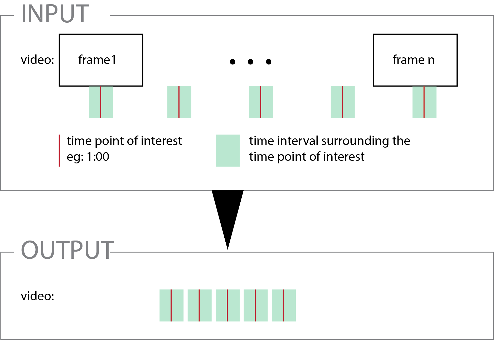

# videoSegment
Usage with `ffmpegProcess.py`  

crop video in time and make a composite master video from the crop segment
This use ffmpeg as a subprocess in python that may facilitate iterations and batch processing
This tool can be used along with [ledDetect](https://github.com/RumbaughLab/ledDetect) script to identify specific segement to be cropped.  
Relies on [ffmpeg](https://ffmpeg.org/).

# videoCompression
Usage with `chkForAviMp4.py`  
  
this function enable the conversion of a file when the file is not updated anymore for example in the context of the highspeed seq file is converted to an avi. When the conversion is completed the size of the file will be static then the compression from avi to mp4 will occur after x amount of time from the finished conversion  
  
To run the script:
1. open command prompt
2. type `py ` then drag the `chkForAviMp4.py` file in the command prompt
3. follow the steps:
     * Drag and drop the file to be converted:
     * How often should the file progresss be monitored (in min): (recommand 15 min)
